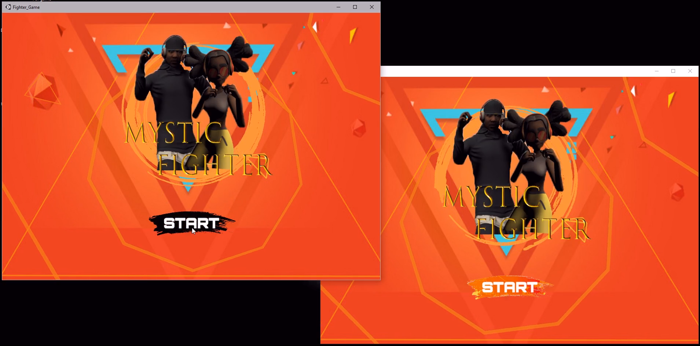
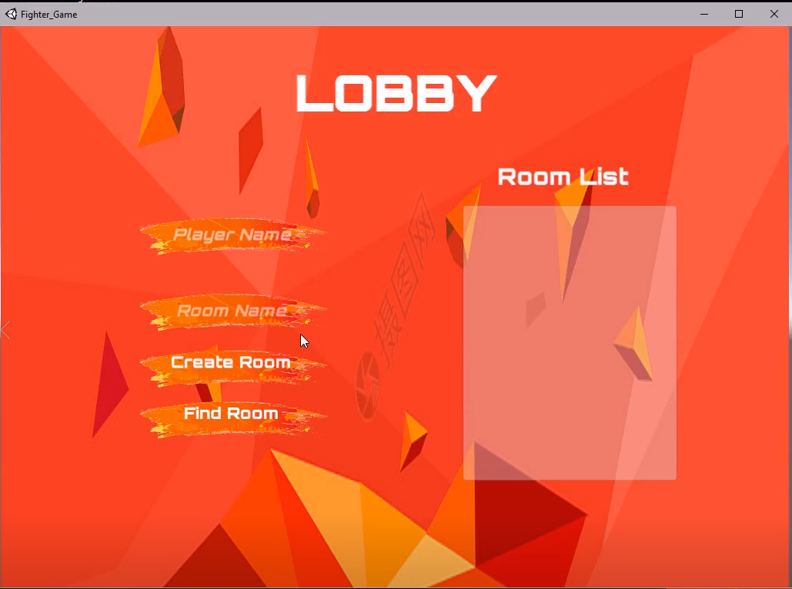
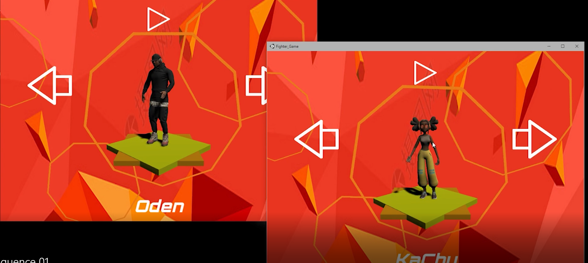
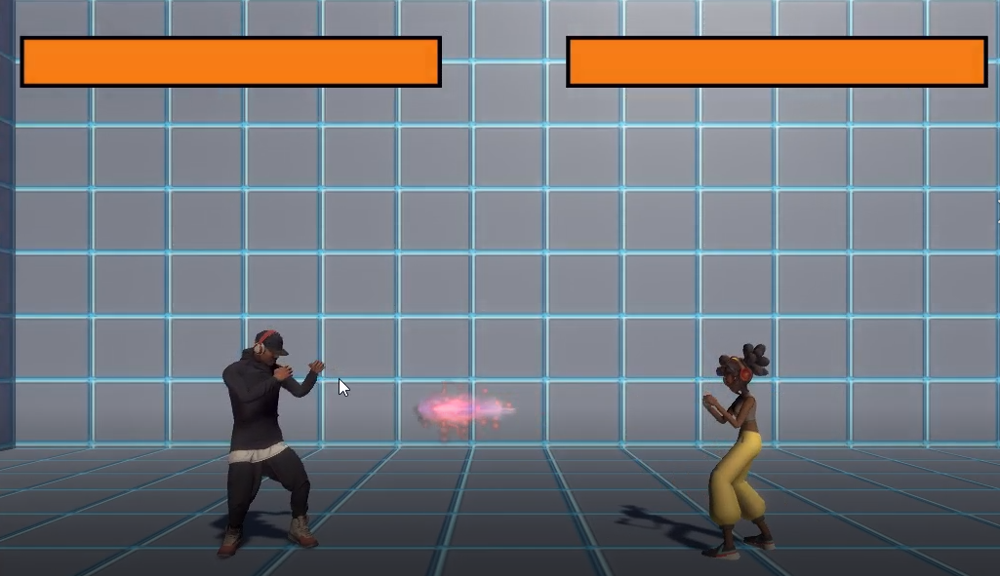
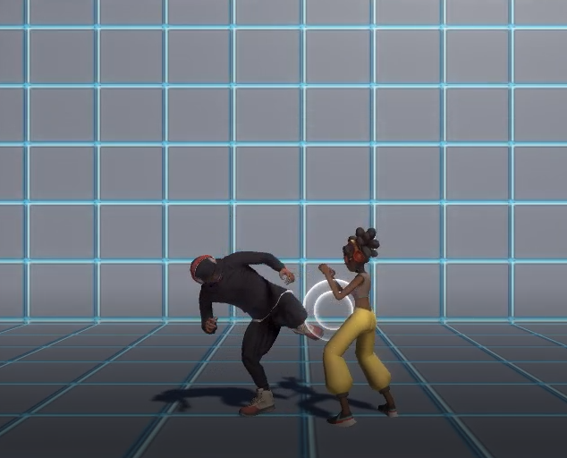

# Mystic Fighter
>3D Multiplayer Fighting Game  
>October 2020 – December 2020 (C#, Unity, PC)
  
-	Implemented network synchronization using PhotonPun2.
-	Implemented lobby for players to create or join a room through the internet.
-	Implemented state machine to handle the character animation and used photonveiw animation to synchronize data.
-	Implemented collision box which can follow the animation.
-	Implemented a camera control system which can make the camera always in the center of two players

## Start Window

## Lobby Window

## Character Selection Window

## Energy Ball

## Hit Effects

